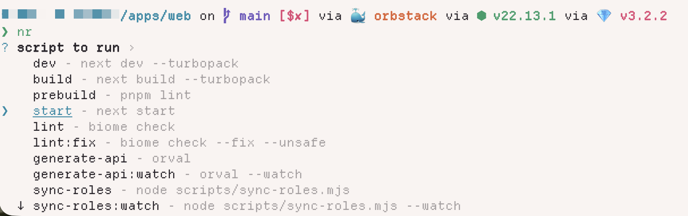

I typed `pnpm run dev` in a yarn project the other week. I watched the wrong lockfile pop into the VSCode explorer, sighed, deleted it, and ran the command I should've typed in the first place.

I jump between a lot of projects, and it feels like they all use different package managers. You can tell how old the project is based off which package manager was used. My own stuff uses bun because it's wicked fast. Client projects that need Node get pnpm if I have any say in it. But I've inherited a couple of yarn projects (one classic, one modern, because of course), and there's one client project still on npm. Don't ask me to justify that last one, I'll upgrade it as soon as I can.

That's four package managers. Four different install commands, four different "run a script" syntaxes, four different "add a dev dependency" flags. My fingers have muscle memory for the things I do frequently, which means I'm constantly typing the wrong thing in projects that aren't mine.

## The muscle memory tax

The commands aren't wildly different, but they're different enough to trip you up:

```bash
# Install a dev dependency
bun add -d vitest
pnpm add -D vitest
yarn add -D vitest
npm install --save-dev vitest
```

Four ways to do the same thing. And if you get it wrong, you don't always get a clean error. Sometimes you just silently create a `package-lock.json` in a pnpm project, or a `yarn.lock` appears out of nowhere, and now your next PR has a rogue lockfile in it.

I've got an fzf plugin that gives me fuzzy autocomplete on package.json scripts, which is great for the "what scripts does this project have?" problem. But it doesn't help with the "which package manager do I use to run them?" problem.

## `ni` fixes this

[ni](https://github.com/antfu-collective/ni) is a tiny CLI that detects your package manager by looking at the lockfile in your project, then runs the right command.

It also respects the `packageManager` field in `package.json`, and the detection walks up the directory tree so it works in monorepo subdirectories. If there's no lockfile at all, it falls back to whatever you've configured as your default.

The command names are brilliant, and they're a great example of [names that tell you exactly what they do](/blog/it-does-what-it-says-on-the-tin):

| Command | What it does | npm equivalent |
|---------|-------------|----------------|
| `ni` | Install | `npm install` |
| `ni vite` | Add a package | `npm install vite` |
| `nr` | Run a script | `npm run` |
| `nlx` | Execute a package | `npx` |
| `nun` | Uninstall | `npm uninstall` |
| `nci` | Clean install | `npm ci` |

`ni` = install. `nr` = run. `nun` = uninstall. You don't need docs open to remember these.


## My setup

Install it globally with whatever you prefer:

```bash
# I use bun globally
bun install -g @antfu/ni
```

If you're using bun for global installs, make sure its bin directory is on your PATH:

```bash title="~/.zshrc"
export PATH="$HOME/.bun/bin:$PATH"
```

Then create a `~/.nirc` file for your defaults:

```ini title="~/.nirc"
defaultAgent=bun
globalAgent=bun
```

`defaultAgent` is what ni falls back to when there's no lockfile to detect. I set mine to bun because if I'm starting something from scratch, that's what I want. `globalAgent` controls what runs when you pass the `-g` flag.

## The preview trick

One thing I really like: add `?` to any command and ni shows you what it *would* run without actually running it.

Heads up if you're on zsh: you need to quote the `?` because zsh treats it as a glob wildcard. `ni vite ?` will blow up with `no matches found`. Wrap it in single quotes and you're fine.

```bash
$ ni vite '?'
# bun add vite

$ nr dev '?'
# bun run dev
```

## How it pairs with fzf

This works with the fzf plugin I use, so I get fuzzy search over `package.json` scripts. 

Now I type `nr `, tab, fzf kicks in, I pick the script, and hit enter. 

## The small things

`nr` without arguments gives you an interactive picker for scripts, which is nice in projects where `package.json` has 30 scripts and you can't remember the exact name. `nci` maps to clean install (`npm ci`, `pnpm install --frozen-lockfile`, etc.), which is what you actually want in CI pipelines, and it saves you from remembering that pnpm's flag is `--frozen-lockfile` while npm's is just `ci` as a separate command entirely.



And if you're [setting up a new machine](/blog/setting-up-a-new-mac), ni is one of those tools I'd put in the "install on day one" category. It pays for itself the first time you context-switch between projects and don't have to think about which package manager you're in.

## Worth it?

`ni` doesn't do anything you can't do yourself. You could just remember the commands. But the best developer tools don't give you new capabilities, they remove friction from things you already do a hundred times a week. I haven't accidentally created a rogue lockfile in months, and I don't think about which package manager I'm in anymore. Turns out that was never a problem worth solving with my brain.
