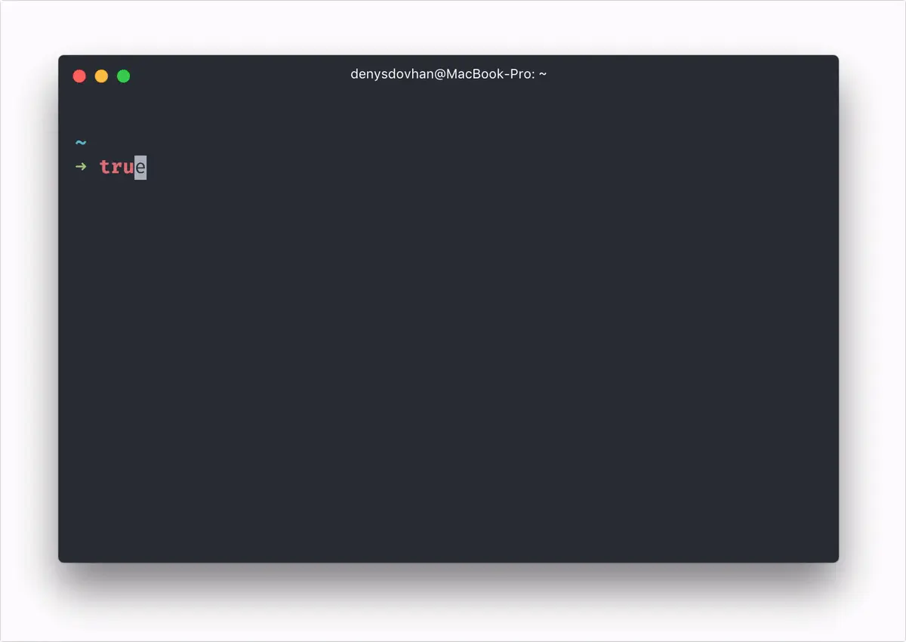

Every once in a while, I get asked by friends and colleagues for tech tips. Especially when they're diving into the MacOS ecosystem.

Yesterday, I was chatting with [Gordon](https://twitter.com/GordonBeeming) - he wanted the low down on being a .NET developer and using a Mac. Fair enough, I've switched back and forth a few times. I was fairly candid, life on the Mac has it's pros and cons - thankfully most of the tooling has such a great cross platform experience. There are some gaps on both systems, but there are apps to fill them.

> It's a great time to be a developer! There's so much great hardware and software, you're spoilt for choice.

I like to have the same experience everywhere, so I like having laptops, so in the end, I give priority to how hot it (the laptop) gets, do I hear the fans, and "where's the charger?" (battery anxiety) over other areas.

I guess this helped convince him 😅


I got a teams message from Gordon, later that night he wanted some advice on setting it up and what to install.


Time to save some keystrokes and capture my current setup as a blog post.

> My starting point is always the same: Homebrew.

## The Starting Block

[Homebrew](https://brew.sh/) is the best package manager for MacOS (if you are coming from Windows, think of it like winget or Chocolatey). It's the first thing I recommend installing on a new Mac. Why? Because it is so easy to install and update software with!

Installing it is looks a little scary for people unfamiliar with terminal commands:

```shell
/bin/bash -c "$(curl -fsSL https://raw.githubusercontent.com/Homebrew/install/HEAD/install.sh)"
```

Once installed, it's as simple as running `brew install [package]` to install tools, applications, and even fonts.

## Building the Arsenal

After setting up Homebrew, I'd start with the applications that I find indispensable:

- [iTerm2](https://iterm2.com/) - A replacement for the default Terminal app, with better features like split panes, quake mode and search.

  ```shell
  brew install --cask iterm2
  ```

- [Fig](https://fig.io/) - Enhances your terminal experience on MacOS with autocomplete features, adding powerful IDE-like capabilities to your command line workflow (picture Visual Studio intellisense). Also dove tails nicely into VSCode and Rider integrated terminals.

  ```shell
  brew install --cask fig
  ```

  Update: Fig was acquired by Amazon, so they aren't accepting new users at the time of writing, try Amazon CodeWhisperer CLI instead. It doesn't have as many features, but the autocomplete is still 🔥

  ```shell
  brew install --cask codewhisperer
  ```

- [Oh My Zsh](https://ohmyz.sh/) - An open source, community-driven framework for managing your Zsh configuration, providing themes and plugins to enhance your terminal experience. You can configure your prompt just like Oh My Posh, with all the cool stats and powerline glyphs. I've written a detailed guide on [how I set up my terminal](/blog/terminal-setup) with Oh My Zsh and all the productivity plugins I use.

  ```shell
  sh -c "$(curl -fsSL https://raw.github.com/ohmyzsh/ohmyzsh/master/tools/install.sh)"
  ```

  Oh My Zsh has a great plugin model, my favourite is turning on aliases for many common Git operations. It translates to less typing and more doing. For example, `gst` stands for `git status`, `gswm` for `git switch main`, and `gpr` for `git pull --rebase`.

  
  🔥 Hot tip: install the [Spaceship theme](https://github.com/pascaldevink/spaceship-zsh-theme)

- [Nerd Fonts](https://github.com/ryanoasis/nerd-fonts) - Tap into the Nerd Fonts repository to access a variety of developer-friendly fonts that include Powerline symbols pre-baked, enhancing the terminal and code editor aesthetics.
  ```shell
  brew tap homebrew/cask-fonts
  brew install font-caskaydia-cove-nerd-font
  brew install font-monaspace-nerd-font
  ```

### Productivity

- [1Password](https://1password.com/) - A premier password manager that securely stores various passwords, software licenses, and other sensitive information in a virtual vault.

  ```shell
  brew install --cask 1password
  ```

- [Raycast](https://www.raycast.com/) - An alternative to Alfred and Spotlight, it offers a command bar to launch apps, find documents, manage tasks, and automate frequent actions. This deserves a post to itself - it's so good I've let Raycast replace my Spotlight shortcut!

  ```shell
  brew install --cask raycast
  ```

- [Rectangle](https://rectangleapp.com/) - A powerful window management app for Mac, enabling you to quickly organize and manipulate windows through easy-to-use keyboard shortcuts and snap areas.

  ```shell
  brew install --cask rectangle
  ```

- [Bartender](https://www.macbartender.com/) - A macOS utility that helps you organize and hide menu bar icons, keeping your workspace tidy and free from distractions.

  ```shell
  brew install --cask bartender
  ```

- [CleanShot X](https://cleanshot.com/) - A versatile screen capture tool for Mac that offers powerful features such as capturing scrolling content, annotating screenshots, and recording your screen with audio.

  ```shell
  brew install --cask cleanshot
  ```

- [Arc Browser](https://thebrowser.company/) - A modern web browser designed to enhance productivity with a focus on design and user experience, offering unique features such as organizing tabs into stacks and a customizable interface.

  ```shell
  brew install --cask arc
  ```

- [UnnaturalScrollWheels](https://github.com/ther0n/UnnaturalScrollWheels) - A simple utility that reverses the direction of scrolling with a physical mouse wheel on MacOS, making it behave like traditional Windows scrolling whislt keeping the trackpad in 'natural' scrolling mode.
  ```shell
  brew install --cask unnaturalscrollwheels
  ```

### Presentation tools

- [Camo](https://reincubate.com/camo/) - Upgrade your webcam for your Mac, featuring Pan-Tilt-Zoom (PTZ) functionality, enhancing your video calls with superior image quality and camera control.

  ```shell
  brew install --cask camo-studio
  ```

- [Camtasia](https://www.techsmith.com/video-editor.html) - A full-featured screen recorder and video editor that allows you to create professional-looking videos, ideal for tutorials, presentations, and online courses.
  ```shell
  brew install --cask camtasia
  ```
- [Presentify](https://presentify.compzets.com/) - A Mac app perfect for annotating your screen, highlighting things or drawing on your screen; it's the closest alternative to ZoomIt for Mac users, offering similar functionality for presentations.

  Get it from the AppStore [https://apps.apple.com/us/app/presentify-screen-annotation/id1507246666](https://apps.apple.com/us/app/presentify-screen-annotation/id1507246666)

### Dev tools

- [Visual Studio Code](https://code.visualstudio.com/) - A versatile code editor that's become the de facto choice for many developers.

  ```shell
  brew install --cask visual-studio-code
  ```

- [Rider](https://www.jetbrains.com/rider/) - A fast and powerful cross-platform .NET IDE by JetBrains, which provides an extensive set of features for .NET developers, including strong C# analysis, testing tools, and Docker integration.

  ```shell
  brew install --cask rider
  ```

- [Docker](https://www.docker.com/) - Essential for containerization, Docker simplifies the creation, deployment, and running of applications using containers, streamlining the development process across different environments.

  ```shell
  brew install --cask docker
  ```

  To get the most out of Docker on MacOS (and stay withing licensing requirements) - I suggest using [Colima](https://github.com/abiosoft/colima). It's a lightweight alternative to Docker Desktop (not the UI but the runtime). With Colima, you can start a container runtime with `colima start` and enjoy features such as automatic resource allocation and DNS resolution.

  ```shell
  brew install colima
  colima start
  ```

- [Azure Data Studio](https://docs.microsoft.com/en-us/sql/azure-data-studio/) - A cross-platform database tool for data professionals using the Microsoft family of on-premises and cloud SQL databases, offering a modern editor experience with IntelliSense, code snippets, source control integration, and an integrated terminal.

  ```shell
  brew install --cask azure-data-studio
  ```

- [Microsoft Azure Storage Explorer](https://azure.microsoft.com/en-us/features/storage-explorer/) - A powerful standalone app from Microsoft that lets you easily work with Azure Storage data on Windows, macOS, and Linux.

  ```shell
  brew install --cask microsoft-azure-storage-explorer
  ```

- [Postman](https://www.postman.com/) - A full-featured tool for API development, Postman streamlines the testing, documentation, and sharing of APIs, facilitating a more efficient and collaborative workflow for developers.
  ```shell
  brew install --cask postman
  ```

### .NET Development

Microsoft publish Homebrew packages for the .NET SDK but they are setup in such a way that you can only run 1 version 😭. For example, when I want to run preview versions, I'm blocked since the preview package will uninstall any stable ones already installed. 🩸

The community comes to the rescue with a tap repository that allows you to install multiple .NET SDK versions side by side, they way it was intended. By "tapping" (pun intended) into https://github.com/isen-ng/homebrew-dotnet-sdk-versions, you gain access to a range of .NET SDKs:

```shell
brew tap isen-ng/dotnet-sdk-versions
brew install --cask dotnet-sdk8-0-100
brew install --cask dotnet-sdk6-0-400
brew install --cask dotnet-sdk3-1-400
# And so on for other versions...
```

Now you can still use `brew` to install your .NET SDKs _and_ have multiple versions ready depending on project requirements.

## Managing Node.js

Managing multiple versions of Node.js is another thing alltogether. Having worked on many Angular projects, using the right version of Node is super important to me. I like to leverage [NVM (Node Version Manager)](https://github.com/nvm-sh/nvm) - it lets me seamlessly switch between versions, making it easy to work on Client A's project one day, then Client B's the next. If your shell is starting to feel sluggish after adding all these tools, check out my guide on [speeding up your Zsh startup time](/blog/speeding-up-zsh-startup) where I cut mine from 640ms to 120ms.

```shell
brew install nvm
mkdir ~/.nvm
```

Then add the following to your .zshrc or .bash_profile to initialize NVM:

```shell
export NVM_DIR="$HOME/.nvm"
[ -s "$(brew --prefix nvm)/nvm.sh" ] && \. "$(brew --prefix nvm)/nvm.sh"  # This loads nvm
[ -s "$(brew --prefix nvm)/etc/bash_completion.d/nvm" ] && \. "$(brew --prefix nvm)/etc/bash_completion.d/nvm"  # This loads nvm bash_completion
```

Now, you can install any Node.js version you need:

```shell
nvm install node # This will install the latest version of node
nvm install lts # This will install the latest LTS version of Node.js
nvm install 14 # This will install Node.js version 14
```

And switch between them as necessary:

```shell
nvm use node # This will switch to the latest version
nvm use lts # This will switch to the LTS version
nvm use 14 # This will switch to version 14
```

## Conclusion

For my Mac, Homebrew is really important for me to streamline the installation of software.

Don't forget the importance of a good password manager like 1Password or the convenience of having a screen capture tool like CleanShot X. I get a lot of positive feedback about the webcam when on calls thanks to Camo, and people find it easy to follow along to screen shares thanks to Presentify.

Remember, the goal isn't just to work smarter, but to make it actually nice to do work, allowing you to do your best work seamlessly.

Happy tinkering!
