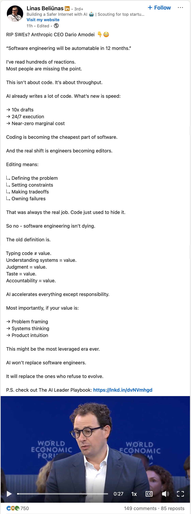

So [Adam Cogan](https://adamcogan.com) sent me this post on LinkedIn the other day and asked to highlight bits I agree with and bits that I don't. Instead, I'm sending him this URL as I agree with a lot of the post, and sometimes it helps to explain the why.

## The LinkedIn Post

https://www.linkedin.com/posts/linasbeliunas_rip-swes-anthropic-ceo-dario-amodei-activity-7419778520974983168-vgJ8

## My Thoughts

The "RIP SWEs" posts have been flooding my feeds for a while now. I'm a bit over it.

Only a Sith deals in absolutes. I cringe a little since it completely misses the point of what software engineering actually is. Sure, AI tools are getting more powerful and can spit out some decent code... but here's the thing... software engineering has never been just about writing code.

IMHO, AI isn't going to 100% automate software engineering. Yes, we are going to be able to automate a lot of tasks, especially repetitive ones or ones that we usually identify as things we should do but the ROI never justifies it as a drop all things item. I admit, this alone will be huge.

I think it's going to make the industry double down on the fundamentals we already know are critical: documentation, clean coding practices, patterns, and—maybe most importantly—testing.

### What Software Engineering Really Is

Software engineering is about:

- **Understanding problems** - AI can suggest solutions all day long, but actually understanding the problem space? That requires deep domain knowledge and human insight
- **Making architectural decisions** - Choosing the right architecture, weighing patterns and trade-offs—this stuff requires experience, judgment, and someone willing to own the decision
- **Communicating with stakeholders** - Translating business needs into technical requirements and vice versa (and trust me, this is harder than it sounds)
- **Maintaining and improving systems** - Here's a reality check: most software engineering work isn't writing greenfield code. It's maintaining and improving existing systems

### AI as a Tool, Not a Replacement

I see AI tools like Copilot, and others as powerful multipliers for software engineers, not replacements. They can:

- Speed up routine coding tasks
- Help explore unfamiliar APIs and libraries
- Assist with boilerplate and repetitive code
- Provide quick references and documentation

But they still require a skilled engineer to:
- Validate the output
- Integrate it into the larger system
- Ensure it meets quality standards
- Adapt it to the specific context

That said, working with AI agents does introduce new workflow challenges. If you're using AI coding assistants and find yourself constantly checking if they're done, I wrote about how [audio notifications can help you stay in flow](/blog/peon-ping-setup) while delegating work to AI.

Saying it has near-zero marginal cost? That's honestly pretty superficial. It completely ignores the hidden costs of software development. Things like maintainability, security, and domain knowledge. AI doesn't solve these problems. In fact, here's the twist: for AI to be effective, you still need a clean codebase, rigorous documentation, and thorough testing. So... we're right back where we started.

The developer's role hasn't really changed. You still need a person who understands the system, can rationalize trade offs, identify novel improvements, and understands how to identify business value.

> Maybe we'll be called builders instead of developers, but the core skills remain the same.
> - Me

AI's effect on software engineering? It's just history repeating itself:

- Mathematicians and the calculator
- Accountants and spreadsheets (VisiCalc)
- Architects and AutoCAD

And look, since this isn't exactly a new phenomenon, it's been studied before. I asked Gemini 3 Flash to explain it:

> In economics, the [Jevons Paradox](https://en.wikipedia.org/wiki/Jevons_paradox) states that as a tool makes a resource more efficient (and thus cheaper), the demand for that resource actually increases rather than decreases. Spreadsheets made accounting cheaper, so companies hired more accountants to do deeper analysis

Spreadsheets let financial people do more complex financial analysis.. rather than a need for fewer accountants. AI is certainly allowing more software being built (and more rapidly). I expect that this will increase the demand for developers, specifically for those who can effectively wield these systems.

### Slowing Down to Go Fast... to 10x or to 0.1x

> You are absolutely right...
> - GPT-4, Jan 2024

There's no 2 ways about it, AI is sycophantic AF. What's worse is that it'll use overly confident language to agree with a terrible idea just to please you. Which means you now have the ability to ruin things much faster than before. Fun, right?

More than ever, there's a need to "slow down to go fast." You have to think deeply about the architecture and validate the output before letting the AI start sprinting ahead.

That being said, there's nothing wrong with accepting a "good enough" approach so you can get stuff done. Not every problem requires a perfect answer. Sometimes, shipping a "good enough" product rapidly is more valuable than spending weeks perfecting every detail. Also, you might not have noticed but you have a tool that can crank out iterations at lightning speed, so you can always improve later based on real user feedback.

Taking all this into account, it shifts the core skills we need to focus on:

1. **Higher-level thinking** - More time on architecture and design, less on syntax. You don't need to memorize how to do a bubble sort algorithm, just know when and why to use one.
2. **Human Connection** - Being able to effectively communicate with "the business" and stakeholders is more important than ever. If you are just a code monkey, then AI can replace you.
3. **Domain expertise** - Understanding the problem domain, the business context, and how the business can use the tech becomes even more critical.
4. **Critical evaluation** - We can get AI to review code generated by AI, but in the end a person needs to sign off on that PR. Being able to quickly assess and validate code quality is a must-have skill.
5. **AI collaboration** - With all that in mind, you need to learn to effectively use AI tools as part of your workflow. When you are trying to find someone to build your house, are you going to hire the builder who uses a measuring tape, hammer, and saw, or the one who uses a laser measure, nail gun and power saw? The one who can use the best tools to get the job done faster and better.

I don't believe we'll necessarily see shorter lead times overall though... Instead, we'll just use that time to deliver a 100% fit-for-purpose product that's been validated by real-world use.

### What This Means for Junior Engineers

Okay, this part's actually kind of scary. There are people out there who genuinely think we don't need junior engineers anymore. 

There's a legitimate concern about how junior engineers will develop their skills when AI can generate so much of the code. But like I said earlier, code has never been the core of software engineering.

Here's what I think Junior Engineers should focus on:

- Communication is a core technical skill. Describing a problem clearly, whether you're talking to another dev, a client, or an AI agent? That's now half your job. You can't just "hide" behind code anymore, you have to articulate your reasoning.
- Mentorship is more important than ever (seriously, this can't be understated)
- Focus your shift to understanding concepts rather than memorizing syntax
- You need to learn to think critically about code, not just write it. The how, why, when, and where are just as important as the what.
- Pair programming (which is mostly communication) with both humans and AI is an awesome way to learn and get feedback

## Conclusion

Software engineering isn't dying, it's changing. Just like we evolved from punch cards to high-level languages, from waterfall to agile, we're now adapting to work alongside AI.

The engineers who'll thrive? They're the ones who embrace these tools while continuing to develop the uniquely human skills that make great people.

So what are your thoughts? Are you concerned about AI's impact on software engineering, or are you excited about the possibilities? I'd love to hear your take.